# ABcon - Construction Project Management System

## Quick Context (for Claude & Developers)

### What is ABcon?

ABcon is a comprehensive construction and real estate project management system designed for Israeli construction companies. It manages the complete lifecycle of construction projects from planning through execution to completion.

**Key Features:**
- Project management (planning, execution, tracking)
- Financial management (estimates, tenders, budget, payments)
- Professional network management (contractors, consultants, suppliers)
- Task & milestone tracking
- Document management
- Hebrew RTL interface (right-to-left)

**Primary Users:**
- Construction project managers
- Real estate entrepreneurs/developers
- Accountants
- Site supervisors

---

### Tech Stack

**Frontend:**
- React 19.2 + TypeScript 5.9
- Vite 6.0 (build tool)
- React Router 7.10 (client-side routing)
- TailwindCSS 3.4 (styling)
- Material Symbols (icons)

**Backend/Database:**
- Neon PostgreSQL (serverless PostgreSQL)
- Direct database queries (no ORM)
- Service layer pattern for business logic

**State Management:**
- React Context API
- Local state with hooks
- Migrating from localStorage to database persistence

**Key Libraries:**
- xlsx (Excel export)
- date-fns (date manipulation)
- react-toastify (notifications)

---

### Current Status

**Development Phase:** Active Development - Phase 4/6 of Estimate Integration (67% complete)

**Active Work:**
- ✅ Phase 1: Database foundation (estimate locking, bidirectional linking) - COMPLETE
- ✅ Phase 2: Cost control page structure - COMPLETE
- ✅ Phase 3: Estimates UI with full CRUD - COMPLETE
- ✅ Phase 4: Tender integration - COMPLETE
- ⏳ Phase 5: Budget auto-update from tender winner - NEXT
- ⏳ Phase 6: Polish, testing, deployment - PLANNED

**Production-Ready Modules:**
- ✅ Dashboard (analytics & quick actions)
- ✅ Projects (CRUD with full detail pages)
- ✅ Professionals (contractors, consultants, suppliers)
- ✅ Budget (line items with variance tracking)
- ✅ Tenders (participant management, winner selection)
- ✅ Estimates (planning & execution with locking)

**In Development:**
- Budget auto-creation from tender winners
- Enhanced variance tracking

---

## System Architecture

### High-Level Architecture


**Architecture Patterns:**
- **Service Layer Pattern**: All business logic in `src/services/` files
- **Component-Based UI**: Reusable React components in `src/components/`
- **Page-Based Routing**: Main pages in `src/pages/` with nested tabs
- **Direct Database Access**: Service functions query Neon PostgreSQL directly

---

### Module Relationships


**Key Workflow:**
1. Create **Planning Estimate** (consultants, permits)
2. Create **Execution Estimate** (contractors, materials)
3. Export estimate → **Tender** (send to multiple contractors)
4. Collect quotes → Select **Winner**
5. Auto-create **Budget Item** (from winner's quote)
6. Track **Payments** against budget

---

## Database Schema

### Simplified ERD (Core Tables)


**Key Relationships:**
- **1:1** - `project_item_estimates.tender_id` ↔ `tenders.estimate_id` (bidirectional link)
- **1:N** - One project has many items, estimates, tenders, budget items
- **1:N** - One tender has many participants
- **1:N** - One budget item has many payments

**Important Design Decisions:**
- **Estimate Locking**: When tender winner is selected, source estimate is locked (prevents accidental edits)
- **Bidirectional Linking**: Estimates know their tender, tenders know their source estimate
- **Change Detection**: `is_estimate_outdated` flag tracks when estimate changes after export
- **Snapshot Storage**: `estimate_snapshot` (JSONB) preserves tender state at creation time

---

## Key Workflows

### Estimate → Tender → Budget Flow

```mermaid
sequenceDiagram
    actor User
    participant PE as Planning Estimate
    participant T as Tender
    participant P as Professionals
    participant B as Budget

    User->>PE: 1. Create estimate items
    Note over PE: Add consultants, costs, VAT
    PE-->>User: Show total: ₪150,000

    User->>PE: 2. Click "Export to Tender"
    PE->>T: Create tender with estimate data
    PE->>PE: Mark status as "exported"
    Note over PE,T: Bidirectional link created:<br/>estimate.tender_id ↔ tender.estimate_id
    T-->>User: Navigate to tender page

    User->>T: 3. Add participants
    T->>P: Invite professionals
    Note over P: Email sent (Phase 2)

    User->>P: 4. Professionals submit quotes
    P-->>T: Quote: ₪115,000 (Company A)
    P-->>T: Quote: ₪118,000 (Company B)
    P-->>T: Quote: ₪122,000 (Company C)

    User->>T: 5. Select winner (Company A)
    T->>PE: Lock estimate (status = "locked")
    Note over PE: 🔒 Cannot edit anymore
    T->>B: Auto-create budget item
    Note over B: Amount: ₪115,000<br/>Variance: -₪35,000 (savings!)
    B-->>User: Budget item created

    User->>B: 6. Track payments
    Note over B: Payment 1: ₪50,000<br/>Payment 2: ₪65,000
```



**Key Points:**
- **Locking prevents errors**: Once winner selected, estimate locked to prevent accidental changes
- **Auto-budget creation**: Budget item created automatically from tender winner
- **Variance tracking**: System tracks estimate vs. actual (₪150k estimated → ₪115k contracted = ₪35k savings)
- **Full traceability**: Budget item links back to tender and original estimate

---

### Estimate Status Lifecycle


---

## Critical File Paths

### Services (Business Logic)

**Estimate Management:**
- `src/services/projectItemEstimatesService.ts` - CRUD, locking, export tracking
- `src/services/projectItemsService.ts` - Project items (parent of estimates)

**Tender Management:**
- `src/services/tendersService.ts` - Tender CRUD, winner selection, locking integration
- `src/services/tenderParticipantsService.ts` - Quote management
- `src/services/bomFilesService.ts` - Bill of materials file handling

**Budget & Payments:**
- `src/services/budgetItemsService.ts` - Budget tracking, variance calculation
- `src/services/paymentsService.ts` - Payment tracking

**Core Entities:**
- `src/services/projectsService.ts` - Project CRUD
- `src/services/professionalsService.ts` - Professional network management
- `src/services/tasksService.ts` - Task & milestone management

### UI Components (Pages)

**Main Pages:**
- `src/pages/Dashboard/DashboardPage.tsx` - Main dashboard with KPIs
- `src/pages/Projects/ProjectsListPage.tsx` - All projects grid
- `src/pages/Projects/ProjectDetailPage.tsx` - Single project with tabs
- `src/pages/CostControl/CostControlPage.tsx` - Global estimates/tenders/budget view
- `src/pages/Professionals/ProfessionalsPage.tsx` - Professional network

**Project Tabs:**
- `src/pages/Projects/tabs/OverviewTab.tsx` - Project summary
- `src/pages/Projects/tabs/FinancialTab.tsx` - Financial management (5 subtabs)
- `src/pages/Projects/tabs/TasksTab.tsx` - Tasks & milestones

**Financial Subtabs:**
- `src/pages/Projects/tabs/subtabs/PlanningEstimateSubTab.tsx` - Planning estimate items
- `src/pages/Projects/tabs/subtabs/ExecutionEstimateSubTab.tsx` - Execution estimate items
- `src/pages/Projects/tabs/subtabs/TendersSubTab.tsx` - Tender management
- `src/pages/Projects/tabs/subtabs/BudgetTab.tsx` - Budget tracking
- `src/pages/Projects/tabs/subtabs/PaymentsSubTab.tsx` - Payment tracking

### Shared Components

**Estimate Components:**
- `src/components/ProjectItems/AddProjectItemForm.tsx` - Add/edit estimate items

**Tender Components:**
- `src/components/Tenders/WinnerSelectionModal.tsx` - Winner selection UI

**Shared UI:**
- `src/components/Shared/StatusBadge.tsx` - Status badges with color coding
- `src/components/Shared/Breadcrumbs.tsx` - Breadcrumb navigation
- `src/components/Shared/DataTable.tsx` - Reusable data table

### Database

**Migrations:**
- `migrations/006-complete-project-items-structure.sql` - Project items & estimates foundation
- `migrations/007-enhance-estimate-tender-bidirectional-linking.sql` - **Latest: Locking, bidirectional links, change tracking**
- `migrations/008-update-view-with-estimate-status.sql` - View update for status fields

**Database Config:**
- `src/config/database.ts` - Neon PostgreSQL connection
- `.dev-credentials.md` - Database credentials (DO NOT COMMIT)

### Important Views

**Current View:**
- `vw_project_items_with_current_estimate` - Joins project_items with latest estimate version
  - Now includes: `estimate_status`, `estimate_locked_at`, `estimate_locked_by`, `estimate_locked_reason`, `estimate_exported_at`, `estimate_tender_id`

---

## Documentation Index

**Start Here:**
- 📘 [Getting Started](./docs/GETTING_STARTED.md) - New developer setup (5-minute quick start)
- 📖 [README](./README.md) - Project overview & quick commands

**Architecture & Design:**
- 🏗️ [Architecture](./docs/ARCHITECTURE.md) - Detailed system architecture with diagrams
- 🗄️ [Database Schema](./docs/DATABASE.md) - Complete DDL, ERD, and design decisions
- 🎨 [Design System](./docs/DESIGN_SYSTEM.md) - Colors, typography, spacing, components
- 🔀 [Workflows](./docs/WORKFLOWS.md) - Business process flows (Mermaid diagrams)

**Development Guides:**
- 🧩 [Components](./docs/COMPONENTS.md) - UI component structure & patterns
- 🔐 [Authentication](./docs/AUTHENTICATION.md) - Auth & permissions model
- 🗂️ [Migrations](./docs/MIGRATIONS.md) - Database migration guide

**Operations:**
- 🚀 [Deployment](./docs/DEPLOYMENT.md) - Production deployment guide
- 🧪 [Testing](./docs/TESTING.md) - Test strategy & coverage
- 🔧 [Troubleshooting](./docs/TROUBLESHOOTING.md) - Common issues & solutions

**Specifications:**
- 📄 [Pages Specification](./docs/PAGES_SPECIFICATION.md) - Complete page-by-page spec
- 📋 [Module Specification](./docs/MODULE_SPECIFICATION.md) - Detailed module documentation (1,575 lines)
- 💰 [Cost Control Design](./docs/COST_CONTROL_DESIGN.md) - Cost control page structure

---

## Quick Commands

```bash
# Install dependencies
npm install

# Development server (http://localhost:5173)
npm run dev

# Build for production
npm run build

# Preview production build
npm run preview

# Lint code
npm run lint

# Type check
npm run type-check

# Database
# Connection string in .dev-credentials.md
# Use Neon console or migrations to run SQL
```

---

## Recent Major Changes

### Migration 008 (2026-01-31)
**Update View with Estimate Status**
- Enhanced `vw_project_items_with_current_estimate` to include status fields
- Now returns: `estimate_status`, `estimate_locked_at`, `estimate_tender_id`, etc.
- Enables UI to show lock indicators (🔒 icon)

### Migration 007 (2026-01-30)
**Estimate Locking & Bidirectional Linking** ✅ MAJOR
- Added `status` column to `project_item_estimates` (active | exported | locked)
- Added locking fields: `locked_at`, `locked_by`, `locked_reason`
- Added bidirectional link: `project_item_estimates.tender_id`
- Added change tracking to tenders: `is_estimate_outdated`, `estimate_snapshot`, `estimate_version`
- Auto-backfill existing data
- Created service functions: `lockEstimate()`, `markEstimateAsExported()`, `markTenderAsOutdated()`

### Phase 1-3 UI Integration (2026-01-30)
- Export flow marks estimates as "exported" with timestamp
- Winner selection automatically locks source estimate
- UI indicators: 🔒 locked, 📤 exported
- Disabled edit/delete buttons for locked estimates
- Warning banners for locked and exported items
- "Go to Tender" button for linked estimates

### Earlier Milestones (Jan 2026)
- Form functionality restored with all fields
- Tender navigation fixed (auto-navigate after export)
- Cascade delete (deleting item also deletes linked tender)
- View details modal with comprehensive item information
- Tender display enhancements (larger names, budget shown)

---

## Next Steps

### Immediate (Phase 5)
- ⏳ Budget auto-update when tender winner selected
- ⏳ Enhanced variance tracking & alerts

### Upcoming (Phase 6)
- ⏳ End-to-end testing (Playwright)
- ⏳ Performance optimization
- ⏳ Production deployment
- ⏳ User acceptance testing (UAT)
- ⏳ Documentation completion

### Future Enhancements (Phase 2 - Email Integration)
- Email sending to tender participants
- Email delivery tracking
- Automated reminders for quote deadlines

---

## Project Planning

**Planning System:** GSD (Get Shit Done) methodology

**Planning Documents:**
- `.planning/estimate-integration/PROJECT.md` - Estimate integration vision & constraints
- `.planning/estimate-integration/ROADMAP.md` - 6-phase roadmap with success metrics
- `.planning/estimate-integration/STATE.md` - Current state snapshot (Phase 4/6, 67% complete)
- `.planning/estimate-integration/phases/` - Detailed phase plans, summaries, verification docs

**Progress Tracking:**
- Each phase has: PLAN.md, SUMMARY.md, VERIFICATION.md, UAT.md
- Current status: Phase 4 complete, Phase 5 next
- Estimated completion: 3-4 more weeks

---

## Getting Help

**For Bugs & Issues:**
- Check [Troubleshooting Guide](./docs/TROUBLESHOOTING.md)
- Review error logs in browser console
- Check Neon database logs

**For Development Questions:**
- Review [Architecture](./docs/ARCHITECTURE.md) for system design
- Check [Components Guide](./docs/COMPONENTS.md) for UI patterns
- Read [Database Schema](./docs/DATABASE.md) for data model

**For New Features:**
- Follow existing patterns in similar modules
- Update relevant documentation
- Add tests for new functionality
- Run full test suite before committing

---

## Key Contacts

**Development Team:**
- Full-stack Developer: [Primary developer]
- Client/Product Owner: Niv (user acceptance & requirements)

**External Services:**
- Database: Neon PostgreSQL (serverless)
- Hosting: [TBD - Production deployment pending]

---

## License

[License type TBD]

---

**Last Updated:** 2026-01-31
**Project Status:** Active Development (Phase 4/6 Complete)
**Documentation Status:** 60% Complete → Improving
**Next Milestone:** Phase 5 - Budget Auto-Update (ETA: 1-2 weeks)
