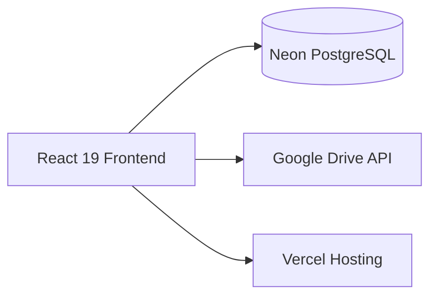

# Architecture - ANcon

## System Overview

Note: Currently the frontend queries Neon directly via @neondatabase/serverless. No separate backend/API layer.

## Tech Stack

| Layer | Technology | Notes |
|---|---|---|
| Frontend | React 19.2 + TypeScript 5.9 | Vite 7.2 bundler |
| Styling | TailwindCSS 3.4 | RTL support via logical properties |
| Database | Neon PostgreSQL (serverless) | Direct queries, no ORM |
| Auth | Custom (bcryptjs) | Role-based, 4 user types |
| Hosting | Vercel | Auto-deploy from main |
| Testing | Playwright 1.58 | E2E + accessibility (axe-core) |
| Exports | jsPDF, ExcelJS, DOCX | PDF, Excel, Word generation |

## State Management

- Global auth state: React Context (`src/contexts/AuthContext`)
- Server data: Direct fetch from Neon on component mount
- Local UI state: useState / useReducer
- No Redux or external state library

## RTL / Hebrew

- Direction: RTL (`dir="rtl"` on root)
- CSS: Logical properties (inline-start/end)
- Dates: dd/mm/yyyy (Israeli standard)
- Currency: ILS (NIS), format: 1,234.56 ₪
- Fonts: System Hebrew fonts
- Design system: `/.claude/design-system.md`

## Service Layer

29 service files in `src/services/` handle all business logic and database queries. Each entity has its own service file.

## Key Decisions

See `/.claude/decisions/` for Architecture Decision Records.

## Deployment

- **Platform:** Vercel
- **Auto-deploy:** Yes, from main branch
- **Environment variables:** Set in Vercel dashboard
- **Build command:** `npm run build`
- **Monitoring:** None configured yet
- **Error tracking:** None configured yet
