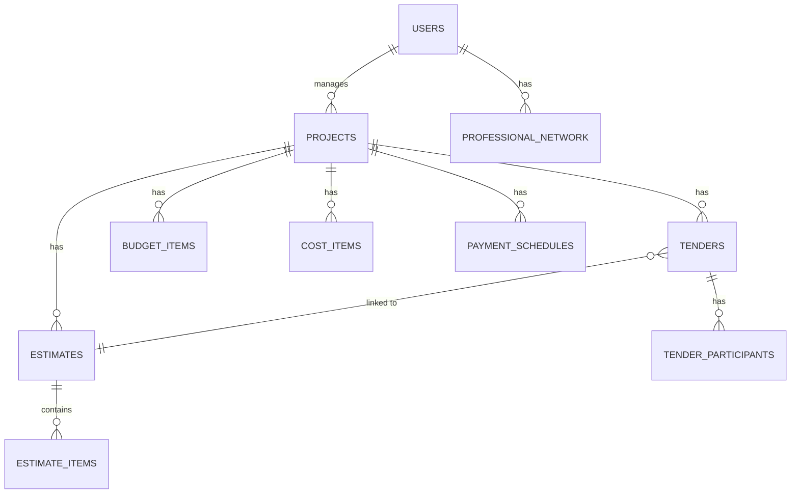

# Data Model - ANcon

Schema source of truth: `/migrations/` (SQL files 001 through 009)

This document covers relationships and business rules. For field-level details, see migration files.

## Entity Relationship Overview

## Users

**Purpose:** Application accounts with role-based access

**Key Relationships:**
- Users manage many Projects (1..n)
- Users have Professional Network contacts

**Business Rules:**
- 4 roles: admin, project_manager, entrepreneur, accountant
- Email must be unique
- Password hashed with bcryptjs

**Schema:** See `migrations/001-create-estimates-schema.sql`

## Projects

**Purpose:** Construction projects being tracked

**Business Rules:**
- Must have a name and owner
- Budget tracking with variance calculations
- Hebrew names expected

## Estimates

**Purpose:** Cost estimates for project work items

**Business Rules:**
- Can be locked (no further edits)
- Export to PDF/Excel
- Linked bidirectionally with Tenders

**Schema:** See `migrations/003-enhance-estimate-tender-tracking.sql`

## Tenders

**Purpose:** Bidding process for project work

**Business Rules:**
- Tender has participants (contractors bidding)
- Winner selection creates budget items
- Linked to estimates for comparison

## Budget Items

**Purpose:** Approved budget line items from winning tenders

**Business Rules:**
- Budget variance tracking (triggers in migration 006)
- Auto-creation from tender winners (in progress)

## Cost Items

**Purpose:** Actual costs tracked against budget

**Schema:** See `migrations/008-create-cost-items-table.sql`

## Payment Schedules

**Purpose:** Planned payment milestones for projects

**Schema:** See `migrations/009-create-payment-schedules.sql`
