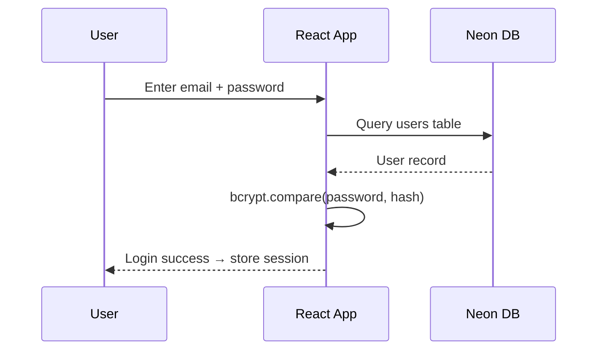

# Authentication & Authorization - ANcon

## Auth Method

**Type:** Email + Password
**Provider:** Custom (direct Neon queries + bcryptjs)
**Session Strategy:** Client-side token (localStorage)
**Previous Provider:** Supabase (migrated away)

## User Roles

| Role | Hebrew | Description |
|---|---|---|
| admin | מנהל | Full system access, user management |
| project_manager | מנהל פרויקט | Manage projects, estimates, tenders |
| entrepreneur | יזם | View projects, approve payments |
| accountant | רואה חשבון | Financial management, reports |

## Permissions Matrix

| Action | Admin | PM | Entrepreneur | Accountant |
|---|:---:|:---:|:---:|:---:|
| Create project | Y | Y | N | N |
| Edit project | Y | Y | N | N |
| Delete project | Y | N | N | N |
| Manage users | Y | N | N | N |
| Create estimate | Y | Y | N | N |
| Lock estimate | Y | Y | N | N |
| Create tender | Y | Y | N | N |
| Select tender winner | Y | Y | Y | N |
| View budget | Y | Y | Y | Y |
| Approve payment | Y | N | Y | Y |
| View reports | Y | Y | Y | Y |
| Export documents | Y | Y | Y | Y |

See also: `AUTH_PERMISSIONS_PLAN.md` (root) for detailed permissions design.
See also: `PRD-Authentication-Permissions.md` (root) for product requirements.

## Auth Flow

## Security Notes

- Passwords hashed with bcryptjs (currently runs client-side)
- Session stored in localStorage
- Protected routes via `ProtectedRoute` component and `AuthContext`
- No server-side session validation (direct DB queries from client)
